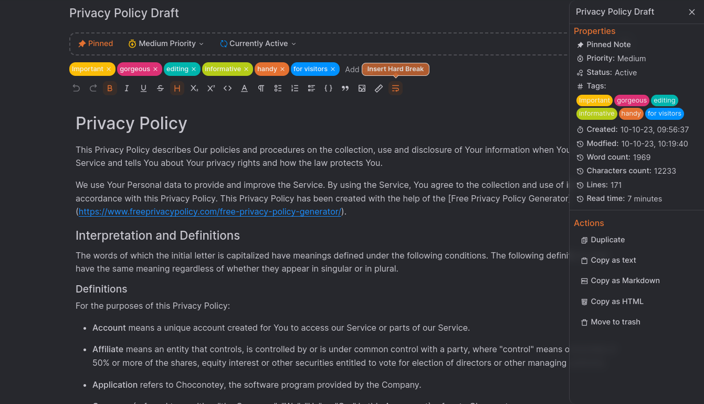

# Notes Client Application (React.JS + Typescript)

This repository contains a **markdown notes application** built with React.JS and Typescript, of course, with a flavor of other awesome community opensource packages.

Taking notes in markdown is made simple with this application. It provides the core features to create, organize, share and export your markdown notes in multiple file formats like JSON, Markdown, HTML and PDF.

Not limited, this application is capable of a robust markdown editing and preview, support for the dark and light modes, syntax highlighting, github flavored markdown and more. You can find the API source code [here](https://github.com/KainNhantumbo/notes-api).

**Access this app live at: [https://choconotey-demo.vercel.app](https://choconotey-demo.vercel.app)**

**Here are some screenshots in default light and dark themes:**




## Project status

Note: This project still under development and not all of the features stated befora are available yet. Further details of its bulding, software architecture and features will be given as the app grows.

## Features Log

### - Release v1.0.0

- Handle create, read, update and delete notes, folder and users on the database.
- Handle user login, registration and authentication with jwt (JSON web tokens) strategy.
- Store all data in Mongo DB, handled by a separated Node.JS with Express.JS server application.

### Scripts for testing

Make sure you have installed **Node.js (v18.17.0 or later recommended) which also comes with npm v9.6.7**.\
In the project directory, you can run in terminal:

```bash
 npm run dev
```

Runs the app in the development mode and the server will reload when you make changes to the source code.

```bash
npm run build
```

Builds the app for production to the **dist folder**.

```bash
npm run start
```

Builds and starts the server in prodution.

## Contact

E-mail: [nhantumbok@gmail.com](nhantumbok@gmail.com 'Send an e-mail')\
Github: [https://github.com/KainNhantumbo](https://github.com/KainNhantumbo 'See my github profile')  
Portfolio: [https://portifolio-dev-mu.vercel.app](https://portifolio-dev-mu.vercel.app 'See my portfolio website')\
My Blog: [https://publish-it-programming.vercel.app](https://publish-it-programming.vercel.app 'Visit my blog site')

#### If you like this project, let me know by leaving a star on this repository so I can keep improving this app.😊😘

Best regards, Kain Nhantumbo.\
**Made with ❤ React + Vite and Typescript**

## License

Licensed under Apache License 2.0. All rights reserved.\
Copyright &copy; 2023 Kain Nhantumbo.

Licensed under the Apache License, Version 2.0 (the "License"); you may not use this file except in compliance with the License. You may obtain a copy of the License at http://www.apache.org/licenses/LICENSE-2.0

Unless required by applicable law or agreed to in writing, software distributed under the License is distributed on an "AS IS" BASIS, WITHOUT WARRANTIES OR CONDITIONS OF ANY KIND, either express or implied. See the License for the specific language governing permissions and limitations under the License.
